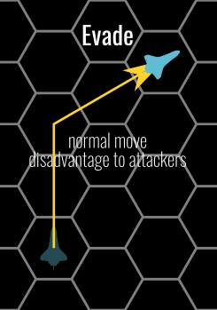

# Starship Combat

The fathomless depths of space are dangerous to even the most experienced crews, but they can be deadly to those who wander the stars unprepared. Planet-crushing black holes, invisible radiation belts, and chaotic meteor storms are found in any system. But of all the hazards that you might encounter between the stars, hostile vessels are by far the most common. The following rules govern combat between starships—or in rare cases, between immense spacefaring creatures.

## Starships vs creature combat

Starship weapons and regular PC-level weapons work on different scales and aren’t meant to interact with each other. If characters choose to shoot at a starship with their laser rifles (or cast a spell at it) while it is on the ground, the GM should treat the starship as an object (a particularly massive one, at that). At the GM’s discretion, if starship weapons are ever brought to bear against buildings or people, they deal Hit Point damage equal to 10 × their listed amount of damage. However, starship weapons are never precise enough to target a single individual (or even small group) and can, if the GM decides, be simulated as deadly hazards instead of weapon attacks.

## Combat basics

When the crew of a starship has hostile intentions toward another vessel, they go to their battle stations and activate their starship’s targeting systems. This is clearly obvious to all other starships in the vicinity with working sensors, though there could still be a chance a hostile vessel can be talked down, if the GM allows it.

No two starships are allowed to occupy the same hex. However, as space is three-dimensional, starships are allowed to move through an hex containing other starships, although doing this with an enemy exposes it to a [Fly-By Shot](#fly-by-shot).

### Attacks

Whenever one starship fires a weapon at another starship, that action is resolved with a gunnery check. Attacks are usually made during the gunnery phase of combat but the [damage](#damage) and critical damage effects are applied after all of the attacks have been made (meaning every starship gets to attack, even if it would be destroyed or crippled by an attack that happened during the same gunnery phase). With only very rare exceptions, each of a starship’s weapons can be fired only once per round. You make an attack using the following procedure:

First, determine the range between the two starships (counted in hexes) and the arc of attack. A weapon can make attacks at disadvantage for targets beyond its range but at most at 5 times its normal range. The attacking starship can fire a weapon against only ships in the same arc as that weapon. If the targeted starship is in a hex that lies in two arcs, the gunner decides which arc’s weapons target it; it can’t be targeted by weapons in two arcs.

After this, the gunner can attempt a gunnery check. The gunnery check is a ranged attack roll. Characters proficient in either Piloting or starship weapons can add their proficiency modifier to this attack roll.

Compare the result of the gunnery check to the target’s Armor Class (AC) or Target Lock (TL), depending on the weapon used. If you attack with a direct-fire weapon and the result of the gunnery check equals or exceeds the target’s AC, you hit the target and damage is determined as normal. If the attack is made with a tracking weapon such as a missile launcher and the result of the gunnery check equals or exceeds the target’s TL, the tracking weapon’s projectile moves its speed toward the target, making turns during this movement as needed (a projectile from a tracking weapon has perfect maneuverability). If it intercepts the target before it reaches the end of its movement, it explodes and deals damage as normal. If not, attempt a new gunnery check at the start of the next gunnery phase to determine whether the projectile continues to move toward the target; you don’t receive any bonuses from computer systems or actions by your fellow crew members from previous rounds or the current round, and you don't need to check for arc or range. If the result of a gunnery check for a tracking weapon is ever less than the target’s TL, the weapon’s projectile is destroyed and removed from play.

### Damage

Combat in space can be highly dangerous to the vessel and its crew. Once a starship has been damaged, critical systems might malfunction or shut down altogether, leaving its passengers without electricity, gravity, or even air. Such damage might also cause a starship to lose its sensors, propulsion, or weapons systems, which could spell defeat during an active engagement.

When a gunner hits with an attack, she rolls the damage dealt by the weapon she is using (without adding any ability modifiers) and determines which quadrant of the targeted starship she hits. A starship’s shield quadrants are the same as its firing arcs. Damage is first applied to any shields the target starship has in the quadrant hit by the attack, depleting a number of Shield Points equal to the amount of damage dealt. If that quadrant’s Shield Points reach 0, that shield is entirely depleted and any excess damage is applied to the target starship’s Hull Points. If the ship doesn’t have shields or if its shields in that quadrant have already been depleted, apply all damage directly to the target’s Hull Points.

If a starship has a Damage Threshold, any attack that would deal damage to its Hull Points equal to or less than this Damage Threshold fails to damage the ship’s Hull Points. If the damage is greater than the Damage Threshold, the full amount of damage is dealt to the ship’s Hull Points.

### Critical Damage

Starship systems can take critical damage, causing them to become less functional and eventually stop working altogether.

Critical damage is scored whenever a gunnery check results in a natural 20 on the die and damage is dealt to the target ship’s hull. A 19 on a gunnery check also deals critical damage if the target starship was the subject of a successful [target system](#target-system) science officer action. Note that critical hits between starships do not deal double damage dice like regular character combat.

Critical damage is also scored whenever the target starship’s hull takes damage that causes its total amount of damage to exceed its Critical Threshold (see page 292) or a multiple of that threshold. For example, a starship with 100 Hull Points and a Critical Threshold of 20 takes critical damage each time its total amount of Hull Point damage exceeds 20, 40, 60, 80, and 100 points (and so on). An individual attack does not need to deal more than 20 damage to score critical damage against this starship; it just needs to be the attack that pushes the starship’s total damage above a multiple of its Critical Threshold.

A starship can take critical damage even when its total Hull Points are below 0.

A starship takes critical damage from an attack only if that attack deals damage to the ship’s Hull Points, even if the result of the gunnery check is a natural 20. If the attack’s damage only reduces a starship’s Shield Points, no critical damage occurs.

When critical damage is scored, the attacking gunner should roll on the table below to randomly determine which of the target starship’s key systems is hit; that system gains a critical damage condition (see below), with the effect listed on the table. If the system isn’t currently critically damaged, it gains the glitching condition. If it is critically damaged again, its critical condition changes by one step of severity (glitching becomes malfunctioning; malfunctioning becomes wrecked). These conditions and their effects on crew actions are explained in [Critical Damage Conditions](#critical-damage-conditions).

If the system you roll is already wrecked, go down to the system below until you reach one that is not wrecked. If you reach the bottom of the table, choose a random crew member and deal an amount of damage equal to the damage roll by the starship weapon. The GM can choose the damage type, although fire, electric, or bludgeoning are typical choices. The character can succeed at a DC 20 Dexterity saving throw to take half damage.

|d10|System|Effect|
|:-:|------|------|
|1|Life support|Condition applies to all captain actions|
|2-3|Sensors|Condition applies to all science officer actions|
|4-6|Weapons array|Randomly determine one arc containing weapons; condition applies to all gunner actions using weapons in that arc (a turret counts as being in all arcs)|
|7-8|Engines|Condition applies to all pilot actions|
|9-10|Power core|Condition applies to all engineer actions except hold it together and patch; a malfunctioning or wrecked power core affects other crew members’ actions (see Critical Damage Conditions below)|

### Critical Damage Conditions

A ship system can be in the following damage status:

* **Fully functional**: No damage taken
* **Glitching.** Crew skill checks involving the system (except the [hold it together](#hold-it-together) and [patch](#patch) engineer actions) must roll a d4 and subtract the number rolled.
* **Malfunctioning.** Crew skill checks involving the system (except the hold it together and patch engineer actions) are made at disadvantage. Also, crew members can’t take push actions using that system. If the power core is malfunctioning all actions aboard the starship not involving the power core take a 1d4 penalty; this penalty stacks with penalties from critical damage conditions affecting other systems.
* **Wrecked.** Crew skill checks involving the system (except the [hold it together](#hold-it-together) and [patch](#patch) engineer actions and [minor crew actions](#minor-crew-actions)) fail automatically. If the power core is wrecked, all crew actions aboard the starship not involving the power core are made at disadvantage.

### Repairs

When a starship combat encounter is over, the crew members can repair damage done to their starship, provided it hasn’t been destroyed and they haven’t been captured! Shields regenerate Shield Points at a set rate (as detailed in its description) as long as the starship’s power core isn’t wrecked. You can double this recharge rate for 10 minutes by taking 1 minute and succeeding at a Intelligence (Engineering) with a difficulty of 15. Any penalties from critical damage conditions apply to this check.

You can remove the critical damage condition from a system by taking 10 minutes and succeeding at an Intelligence (Engineering) check. The DC depends on the severity of the condition (DC 10 for glitching, DC 15 for malfunctioning, and DC 20 for wrecked). The system is no longer critically damaged (it has no critical damage conditions) and can function as normal.

Repairing damage to the hull (restoring lost Hull Points) is more difficult. You must first stop the starship completely, usually at a safe location (for instance, a world with a non-hostile atmosphere or a dock on a space station), and the repairing character or characters must have access to the outside of the hull. On most of the Pact Worlds, the crew can pay mechanics to repair the starship; the cost and time needed are up to the GM. If the crew is on its own in uncharted territory, it can still repair the starship’s hull. Doing so costs 10 UPBs per point of damage to be repaired and requires 5 hours of work (regardless of the number of points repaired) and succeed at a DC 10 Intelligence(Engineering) check. A character can cut either the cost or the time in half by increasing the difficulty by for each halving. Failing this check increases the fix cost by 5 UPB per hit point being fixed. Other engineers can use the Help Other action.

### Teleporting Between Starships

Starships in combat are constantly in motion, so it is impossible for a PC to cast a teleportation spell to travel between vessels. Even if a spell caster has seen the inside of the target starship, the relative speeds between two moving vessels mean that the destination has changed before casting the spell is complete. PCs can teleport only between stationary starships.

## Crew Roles

The actions crew members on a starship can take depend upon their roles. For most roles, multiple people can perform actions each round, but for other roles, only one person can fill that role and only one action for that role can be performed each round. Your role also determines when you act in combat. Starship combat uses the five roles below. You should declare your role when you board a ship (if you declare yourself a passenger, however, you take no special actions in combat unless you assume a role).

Crew members can change their role in the heat of combat, but only at the beginning of a round (before the [Engineering phase](#phase-1-engineering)).

There are no specific character requirements to take one role, and some roles (but not all of them) can be taken by many characters at once. Each roles gives you the ability to perform different actions with the starship at different moments of the round (which are called "phases" and described below).

A starship’s base frame determines the minimum and maximum number of crew members needed to operate that vessel. A starship without its minimum complement can’t be flown. However, when a large NPC starship with its full complement enters starship combat, each individual crew member doesn’t take a regular action—it would take hours to resolve a single round! In such cases, usually on Large or larger starships, most roles simulate entire teams of personnel. The number of crew members required to assist a single officer who wants to attempt a check in that role is listed after the role’s name in a starship stat block. This number varies between starships, and some vessels might have a crew large enough to allow multiple checks for a single role—for instance, a dreadnought might have several teams of engineers or gunners.

### Captain

Your role in combat is about encouraging the crew while taunting enemies into making critical mistakes. A starship can have only one captain, and a character can assume that role only if it is currently vacant. The captain alone can act in any phase of combat.

### Engineer

You work with your starship’s power core and engines to achieve maximum efficiency, grant extra power in times of need, and divert power to vital systems as necessary. You can also repair damaged systems. A starship can have any number of engineers. An engineer acts during the engineering phase.

### Gunner

You operate your starship’s various weapon systems, using them to neutralize or destroy enemy vessels. A starship can have at most a number of gunners equal to the number of weapon mounts. A gunner acts during the gunnery phase.

### Pilot

You plot the course of the ship. Each starship has speed and maneuverability ratings, but you can push your starship beyond these boundaries with enough skill. A starship can have only one pilot, and a character can assume that role only if it is vacant. The pilot acts during the helm phase of combat.

### Science Officer

You use the starship’s computers, scanners, and other systems to identify threats, target foes, and navigate hazards. A starship can have any number of science officers. A science officer acts during the helm phase of combat.

## The Combat Round

Like combat between characters, starship combat occurs over a number of rounds until one side flees, surrenders, or is otherwise defeated. Unlike rounds in combat between characters the turns taken by characters and NPCs are not resolved in initiative order. Each round of starship combat is divided up into three phases, resolved in order with all the starships in combat going through the same phase together. Each character aboard a starship typically acts in only one of these phases, depending on her role on the starship.

### Phase 1: Engineering

The engineers on all ships (if present) each take an action to repair the starships’ systems or give them a boost. These actions occur simultaneously through all the ships, and all engineers, so they can be resolved in any order.

### Phase 2: Helm

In starship combat, tactical position is essential, so being able to know your opponent moves before choosing is an advantage.
Each starship’s pilot attempts a Dexterity (Piloting) check. The pilot with the lowest result must move his starship first, followed by the next lowest, until all starships have moved. This check is repeated each round during the helm phase, so the order of movement can change from round to round. If a starship has no one in the pilot role, that starship acts as if its pilot had rolled a 0. If there is a tie, the pilot with lowest bonus in the Piloting skill must move his starship first. If there is still a tie, the two pilots in question should each roll another Dexterity (Piloting) check and compare the results; the pilot with the lowest result moves first (this roll is used as a tiebreaker).

As they move their starships, pilots can attempt additional skill checks to perform dangerous maneuvers or push their vessels beyond their specifications.

Also during this phase, any character taking on the role of science officer can use the starship’s systems to scan vessels or target foes. Science officers must act immediately before or after their starship’s pilot, but they can jointly decide the order they act.

### Phase 3: Gunnery

During the gunnery phase, gunners fire their starships’ weapons. Starships fire in the same order in which their pilots acted during that round’s helm phase, but the effects of damage are not taken into account until the end of the phase, meaning that all starships can fire, even if they take enough damage to be disabled or destroyed during this phase.

Once all of the phases have been resolved, if there are still combatants engaged in the fight, the next round begins, starting with a new engineering phase.

## Crew Actions

As starship combat progresses, the various crew members aboard each vessel can take the actions their roles allow.

Most of the crew actions described below take one action. As in regular combat you are able to take only one action (usually defined by your role) per round of starship combat. Certain crew actions require a minimum character level or proficiency in a certain skill. NPC crew members are usually assumed to have a proficiency bonus matching the starship tier and be proficient at the activity they are doing.

Some crew actions are flagged as **push actions** in their headers . Push actions are difficult to perform but can yield greater results. You can’t perform a push action if the necessary system is malfunctioning or wrecked.

As your combat expertise grows, you gain extra resolve that can help with high-level crew actions. At 8th level and again at 16th level, you gain 1 Resolve Point at the start of any starship combat encounter. These points can exceed your normal pool of Resolve Points; unspent points gained this way are lost at the end of the encounter.

### Captain Actions

As a captain, you can take any of the following actions, depending on your character level, during any phase of combat.

#### Demand

You can make a demand of a crew member to try to improve his performance. You grant advantage to one specific check by succeeding at a Charisma (Intimidate) check with a DC of 15. You must use this action before the associated check is rolled, and you can grant this bonus to an individual character only once per combat. Demand might result in negative consequences if used on NPCs, and you can’t make demands of yourself.

#### Encourage

You can encourage another member of the crew to give her a bonus to her action. This grants an extra 1d4 to be added to the check required by a crew action if you succeed at a DC 10 check using the same skill. Alternatively, you can grant this same bonus by succeeding at a DC 15 Charisma (Persuasion) check. You can’t encourage yourself.

#### Taunt (Push)

You can use the communications system to broadcast a taunting message to the enemy vessel. To make a taunt attempt you select an enemy vessel and phase. You must make a contested check rolling Cha(Deception) or Cha(Intimidate) versus the Wis(Insight) of an enemy crewmember. The enemy crewmember must be the captain (if present), otherwise the pilot (if present), and otherwise any crewmember (enemy’s choice) who is able to act in the selected phase (if there’s no one, the taunt action has no effect). If you win, the enemy vessel rolls every check in that phase at disadvantage for the rest of this round. Once used against an enemy starship, regardless of the outcome, taunt can’t be used against that starship again during the same combat.

#### Orders (Push)

At 6th level, you can grant an additional action to one member of the crew by spending 1 Resolve Point and succeeding at a skill check at the beginning of the phase in which the crew member would normally act. The type of check depends on the role of the crew member targeted: an Intelligence (Computers) check for a science officer, an Intelligence (Engineering) check for an engineer, a [gunnery check](#attacks) for a gunner, and a Dexterity (Piloting) check for a pilot. The DC of this check is 15. If the check succeeds, the crew member can take two actions in her role this round (both when she would normally act), but she can’t take the same action twice. You can’t give yourself orders.

#### Moving Speech

At 12th level, you can spend 1 Resolve Point and use your action to give a moving speech to the crew during one phase of combat with a successful Charisma (Persuasion) check (DC 20). For the remainder of that phase, your allies have advantage at checks when performing crew actions.

### Engineer Actions

As an engineer, you can take any of the following actions, depending on your ranks in the Engineering skill. These actions can be taken only during the engineering phase. Unless otherwise noted, each action can be performed only once per round, no matter how many engineers are on a starship.

#### Divert

You can divert auxiliary power into one of your starship’s systems, giving it a boost. This requires a successful Intelligence (Engineering) check (DC 10), and the results depend on where you decide to send this extra power. If you send it to the engines, your starship’s speed increases by 2 this round. If you send it to the science equipment, all science officers take advantage to their crew actions this round. If you send it to the starship’s weapons, reroll 1s and 2s in damage rolls of weapons (and keep the new value). If you send it to the shields, restore an amount of Shield Points equal to 5% of the PCU rating of the starship’s power core, up to the shields’ maximum value. Evenly distribute the restored Shield Points to all four quadrants (putting any excess Shield Points in the forward quadrant).

#### Hold It Together

You can hold one system together by constantly patching and modifying it. If you succeed at an Intelligence (Engineering) check (DC 15), you can select one system; that system is treated as if its critical damage condition were two steps less severe for the rest of the round (wrecked becomes glitching, and a malfunctioning or glitching system functions as if it had taken no critical damage). This check isn’t modified by penalties from critical damage to the power core.

#### Patch

You can patch a system to reduce the effects of a critical damage condition. The number of actions and the DC of the Intelligence (Engineering) check required to patch a system depend on how badly the system is damaged, as indicated on the table below. Multiple engineers can pool their actions in a single round to effect repairs more quickly, but each engineer must succeed at her Engineering check to contribute her action to the patch. The number of actions required can be reduced by 1 (to a minimum of 1 action) by increasing the DC by 5. If you succeed at this check, the severity of the critical damage is unchanged, but it is treated as one step less severe for the remainder of the combat, until 1 hour has passed, or until the system takes critical damage again (which removes the patch and applies the new severity). This action can be taken more than once per round, and this check is not modified by any critical damage to the core.

|Critical Damage Condition|Actions to Patch|DC|
|-------------------------|:--------------:|:-:|
|Glitching|1|10|
|Malfunctioning|2|15|
|Wrecked|3|20|

#### Reinitialize Computer

This resets the computer so it can provide a new bonus. This is an action that automatically succeeds and resets all nodes.

#### Overpower (Push)

At 6th Level, you can spend 1 Resolve Point and attempt an Intelligence (Engineering) check (DC 15) to squeeze more out of your ship’s systems. If you’re successful, this functions as the divert action, but you can send extra power to any three systems listed in that action. This action and the divert action can’t be taken in the same round. You must be proficient in Engineering to take this action.

#### Quick Fix

At 12th level, you can try to repair a system quickly by spending 1 Resolve Point and attempting an Engineering check (DC 20). If successful, you remove the critical damage condition from one system for 1 hour (allowing it to function as if it had taken no critical damage), after which time it must be repaired as normal. You must be proficient in Engineering to take this action.

### Gunner Actions

As a gunner, you can take any of the actions below, depending on your character level. These actions can be taken only during the gunnery phase unless stated otherwise. Though each of a starship’s weapons can be fired only once per round, multiple gunners can take actions to fire different weapons in a single round.

#### Fire At Will (Push)

You can fire any two starship weapons, regardless of their arc. Each attack is made at disadvantage.

#### Fly-by Shot

If an enemy starship moves through the hex containing your starship, as a reaction a gunner can fire any one of its direct-fire weapons from any arc at the moving starship, targeting its aft quadrant. If no one is designated as a gunner (often the case in starships with only one crew member) your ship can’t make a free attack. A weapon used for this free attack can still be used as normal later in the round.

Note that this is a gunner reaction that may happen outside of the gunnery phase.

#### Shoot

You can fire one of your starship’s weapons. If you use a turret weapon, you can target a ship in any arc.

#### Broadside (Push)

At 6th level, you can expend 1 Resolve Point to fire all of the starship weapons mounted in one arc (including turret-mounted weapons). Each weapon can target any vessel in that arc.

#### Precise Targeting

At 12th level, you can perform a very precise strike by spending 1 Resolve Point and firing one starship weapon at a single target. If the attack hits and the enemy ship’s shields on that quadrant are depleted before your attack, you deal critical damage to a random system. If the attack would normally cause critical damage, the normal critical damage applies as well (meaning your attack could potentially deal critical damage multiple times; determine which system is damaged as normal each time).

### Pilot Actions

As a pilot, you can take the following actions. These actions can be taken only during the helm phase.

#### Fly

You move your starship up to its speed and can make any turns allowed by its maneuverability. This doesn’t require a skill check.

#### Maneuver

You move your starship up to its speed. You can also attempt a Dexterity (Piloting) check (DC 15) to reduce your starship’s distance between turns by 1 (to a minimum of 0).

#### Stunt (Push)

Instead of ordinary movement, pilots can attempt stunts with their starships, pushing them beyond their design specifications to enact daring moves. Several stunts affect your starship’s Armor Class (AC) and Target Lock (TL).

##### Back Off

The starship moves up to half its speed in the direction of the aft edge without changing facing. It can’t take any turns during this movement. To perform this stunt, you must succeed at a Dexterity (Piloting) check (DC 10). On a failed check, your starship moves backward only 1 hex. If you fail this check by 5 or more, your starship does not move at all and gunnery checks against it have advantage.

##### Barrel Roll

The starship moves up to half its speed and flips along its central axis. For the next gunnery phase, the starship’s port shields and weapons function as if they were in the starboard firing arc and vice versa. The starship reverts to normal at the beginning of the next round. To perform this stunt, your starship must be Large or smaller and you must succeed at a Dexterity (Piloting) check (DC 10). On a failed check, the starship moves half its speed but doesn’t roll. If you fail by 5 or more, your starship moves half its speed, doesn’t roll, and gunnery checks against it have advantage.

##### Evade

The ship moves up to its speed and can turn as normal, but gunnery checks against it get disadvantage. To perform this stunt, you must succeed at a Dexterity (Piloting) check (DC 10). If you fail, the starship moves as normal. If you fail the check by 5 or more, the starship moves as normal, but it also takes a –2 penalty to its AC and TL until the start of the next round.

##### Flip And Burn

The ship moves forward up to half its speed (without turning) and rotates 180 degrees to face the aft edge at the end of the movement. To perform this stunt, you must succeed at a Dexterity (Piloting) check (DC 15). If you fail this check, your starship moves forward half its speed but doesn’t rotate.

##### Flyby

The ship moves as normal, but it can move through 1 hex occupied by an enemy starship without provoking a [Fly-by Shot](#fly-by-shot). During the following gunnery phase, you can select one arc of your starship’s weapons to fire at the enemy vessel as if the vessel were in close range (treat the range as 1 hex), against any quadrant of the enemy starship. To perform this stunt, you must succeed at a Dexterity(Piloting) check (DC 15). If you fail this check, your starship still moves as described above, but you follow the normal rules for attacking (based on your starship’s final position and distance), and the movement provokes a [Fly-by Shot](#fly-by-shot) from that starship as normal.

##### Slide

The starship moves up to its speed in the direction of either the forward-port or forward-starboard edge without changing its facing. To perform this stunt, you must succeed at a Dexterity (Piloting) check (DC 10). If you fail this check, the ship moves forward up to half its speed and can’t make any turns.

##### Turn In Place

The ship does not move but instead can turn to face any direction. If the ship has a maneuverability of clumsy, it takes a –4 penalty to its AC and TL until the start of the next round. If it has a maneuverability of poor, it instead takes a –2 penalty to its AC and TL until the start of the next round. Ships with a maneuverability of average or better do not take a penalty. This stunt doesn’t require a skill check.

#### Full Power (Push)

At level 6, if you are proficient in Piloting, you can spend 1 Resolve Point to move your starship up to 1-1/2 times its speed. You can make turns during this movement, but you add 2 to your starship’s distance between turns.

#### Audacious Gambit

At 12th level, if you are proficient in Piloting, you can spend 1 Resolve Point and attempt a Piloting check (DC = 20) to pull off complex maneuvers. You can move your starship up to its speed, treating its distance between turns as if it were 2 lower (minimum 0). You can also fly through hexes occupied by enemy vessels without provoking [Fly-by Shots](#fly-by-shot). At the end of your starship’s movement, you can rotate your starship to face in any direction. If you fail the check, you instead move as if you had taken the fly action (but still lose the Resolve Point).

### Science Officer Actions

As a science officer, you can take any of the following actions. These actions can be taken only during the helm phase.

#### Balance

You can balance the shields, redirecting power from one quadrant to protect another. With a successful Intelligence (Computers) check (DC 10), you can shift Shield Points (SP) from the shield in one quadrant to the shield in another quadrant, including to depleted shields (after rebalancing, every shield must have at least 10% of the total current SP). Alternatively, you can add up the SP from all the remaining shields and evenly distribute them to all four quadrants, putting any excess SP in the forward quadrant.

#### Scan

You can scan a starship with your sensors to learn information about it. This action requires your starship to have sensors. You must attempt an Intelligence (Computers) check, applying any modifiers from the starship’s sensors.The DC for this check is equal to the passive defense of the target. If you succeed at this check, you learn the first unknown piece of information on the following list. For every 5 by which you exceed the check, you learn another unknown piece of information. Subsequent checks reveal new pieces of information, continuing down this list.

1. **Basic Information:** Living crew complement and ship classification, size, speed, and maneuverability.
2. **Defenses:** AC, TL, total and current Hull Points, total and current Shield Points in each quadrant, and core PCU value.
3. **Weapon:** Information about one weapon, including its firing arc and the damage it deals, starting with the weapon that uses the most PCU. Repeat this entry until all the starship’s weapons are revealed.
4. **Load:** Information about how the starship’s expansion bays are allocated and any cargo the starship might be carrying.
5. **Other:** Any remaining ship statistics.

#### Target System (Push)

You can use your starship’s sensors to target a specific system on an enemy starship. This action requires your starship to have sensors. You must attempt an Intelligence (Computers) check, applying any modifiers from the starship’s sensors. The DC for this is the passive defense value for the target. If you succeed, choose one system (core, engines, life support, sensors, or weapons). The next attack made by your starship that hits the enemy ship scores a critical hit on a natural roll of 19 or 20. If that attack deals critical damage, it affects the chosen system. For any further critical damage resulting from the attack, determine which system is affected randomly as normal. Your starship’s sensors can target only one system on a specific enemy starship at a time, though this action can be used to concurrently target systems on multiple starships.

#### Lock On (Push)

At 6th level, if you are proficient in Computers, you can lock your starship’s targeting system on to one enemy vessel. You must spend 1 Resolve Point and attempt an Intelligence (Computers) check versus the target Passive Defense. If you succeed, your starship’s gunners gain advantage to gunnery checks against the target for the rest of the round. This action can be taken only once per round.

#### Improve Countermeasures

At 12th level, if you are proficient in Computers, you can try to foil enemy targeting arrays and incoming projectiles by spending 1 Resolve Point and attempting an Intelligence (Computers) check vs the passive defense of an enemy starship. If you’re successful, gunners aboard the target starship have disadvantage to gunnery checks against your starship (including checks for tracking weapons).

### Minor Crew Actions

Minor crew actions are computer-aided actions that allow a starship limited functionality if it doesn’t have the necessary crew to fill all the roles (for instance, the lone crew member aboard a Tiny starship might always be the pilot but may need to fire one of the vessel’s weapons in an emergency). You can take a minor crew action regardless of your current role, but only if no other action was performed this round for the role associated with that minor crew action. A minor crew action is a bonus action.

#### Glide

As a bonus action during the helm phase, you give the computer control of the helm following a specific course. You can not take this action if other pilot action (or Glide) has been taken this round, and no pilot actions (or Glide) can be taken after this for the rest of the phase. The starship moves at normal speed, with its distance between turns increased by 2. You are considered the pilot during this round for the purposes of computing AC and TL.

#### Snap Shot

As a bonus action, you give the computer control of the weapons system.  You can not take this action if other gunner action (or Snap Shot) has been taken this round, and no gunner actions (or Snap Shot) can be taken after this for the rest of the phase. The computer fires one of its weapons using the ship’s proficiency bonus (and no ability modifier). 

### Taking Other Actions

During a starship combat round every crew member can perform an action, a bonus action and a reaction as usual, but no movement; if you want to move around the ship you have to leave your station. All crew actions take 1 action unless stated otherwise. While in combat, everybody making crew actions in a ship are assumed to be in the same room (the bridge), but not adjacent to each other; if you move, you are away from the control console and unable to take crew actions. Passengers and crew teams are assumed to be in different rooms of the ship and out of sight, depending on the ship layout. Anything that is not a crew action is resolved at the beginning of the round before the engineering phase. The GM can restrict what non-crew actions actions actually apply and are allowed while in starship combat.

## Encounter Design

From a simple skirmish against pirates to a massive fleet engagement, designing a fun and challenging space combat requires thoughtful planning and careful design on the part of the GM. A crew of PCs can’t simply spend their hard-earned credits to upgrade their starship between encounters as they could with ordinary gear. In addition, often due to the circumstances of the story, the characters might find themselves in a ship that is significantly more or less powerful than their average level might indicate. The GM needs to take these factors into account when deciding what sort of enemies the PCs will face.

Combat between starships of equal tiers is more evenly matched than a fight between PCs and opponents of an equal CR. Usually, there is only one PC ship in the fight, containing the entire party. This means that if the battle is lost, the PCs might be taken captive or perish. As a result, starship combats where the PCs face off against a ship of equal tier and capability are very difficult. Most encounters should be against ships of a lower tier.

In general, the GM decides when starship combat begins, where the combatants are, and which way their starships are facing. This might mean that both sides are facing each other from opposite sides of the grid. However, their relative positions and facing can also be established randomly. Roll 3d6+5 to determine how many hexes separate the opposing sides. If either side consists of more than one starship, this result is the distance between the highest-tier starship on one side of the battle and its counterpart on the other. Other starships should be placed within 3 hexes of an allied starship. Then, roll 1d6 for each group of starships to determine the facing of the starships in that group, with a 1 meaning the starships are facing the top edge of the grid, and with 2 through 6 proceeding clockwise around the hex.

