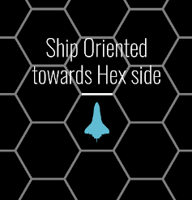
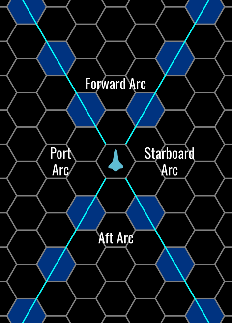
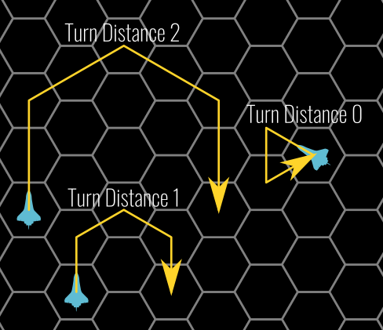

# Tactical Rules

When simulating close encounters in space, Star5er uses a set of rules that are different than the rules used for ground combat. While most of the details about [starship combat](combat.md) are explained in a further chapter, this section introduces some basic elements that will also help you understand how to [build starships](build.md) effectively.

## Local Space Maps: Position and Speed

Starship combat is played on a grid of hexes with figures representing the starship combatants. The hexes don’t represent a specific distance, as Star5er’s portrayal of movement and combat in three-dimensional space is more fluid and narrative than realistic. Unless otherwise specified, each ship occupies 1 hex, regardless of its size. No two starships are allowed to occupy the same hex. 

Occasionally maps may contain other elements beside starships that may occupy one or more hexes, like asteroids, space stations, wormholes, etc. There are no pre-established rules for those elements here, so the GM is free to determine their effects.

## Starship orientation

Unlike ground combat, orientation of the starships is significant. Tactical use of orientation is key for engaging enemies effectively. The ship orientation affects the following aspects:

* Movement: it's generally easier to go forward than to change direction
* Offense: Most weapons are mounted in a given direction, and will be able to fire at targets in that direction. Some weapons may be able to fire at a wider arc, or installed on a mobile turret with a 360⁰ arc. You'll want to keep your enemies towards the direction were you have most firepower, and they will want to evade.
* Defense: Ships have shields that can hold different charge towards different directions (which can be rebalanced tactically during combat). Attacks coming from a given direction will affect different shields, and you'll likely want to put your strongest shield towards your most dangerous attackers.

Starships on the grid have a specific orientation in their hex, with the bow of the ship always aiming to one of the six hex sides, and never towards a corner:

For each ship, its orientation determines four quadrants, called "arcs", as seem in the diagram below. The place (**firing arc**)were weapons are mounted (and some special qualities) will determine which arcs it may shoot, and enemies in a given arc will affect shields in that arc (**shield quadrant**).

Hexes marked in blue in the diagram are always considered in the forward/aft arcs, never in the port/starboard arcs.

## Movement

### Speed

In tactical situation, the **speed** of ships and other objects (like missiles) are measured in hexes. A speed will be a number that indicates how many hexes an object can move (going from one hex to one of the six adjacent ones). All starships have a speed.

In normal conditions, a pilot can move a ship up to its speed or less hexes. This movement is in a straight line in the orientation the starship is facing, though a starship’s facing can be altered while it moves by making turns (see below).

### Maneuverability

While moving, a starship can make turns, altering its orientation, firing arcs, and shield quadrants. One turn changes a starship’s forward facing by 60 degrees, or one side of a hex. Every round in which a starship turns, it must move a certain number of hexes before each turn, determined by its **maneuverability**. A ship's maneuverability can be computed by following the rules for [building starhips](build.md), and it indicates the distance a starship must move in a straight line before changing direction. A ship’s maneuverability also provides a modifier for Dexterity (Piloting) checks made by its pilot:

|Maneuverability|Distance Between Turns|Piloting Check Modifier|
|---------------|:--------------------:|:---------------------:|
|Clumsy|4|–2|
|Poor|3|–1|
|Average|2|0|
|Good|1|+1|
|Perfect|0 (see below) |+2|

 For example, a ship with average maneuverability(distance between turns 2) making two turns in a round must move at least 2 hexes before turning for the first time in a round, and at least 2 more hexes before its turning again. If a starship has perfect maneuverability (the distance between turns is 0), the ship can make two turns (120⁰, or 2 hex sides) for each hex that it moves (allowing it to take a full turn around a single point). 
 
 

 

The number of turns per round a starship can take is limited only by its speed and maneuverability. Turns don’t count against a starship’s movement speed. If a ship with average maneuverability (distance between turns 2) has a speed of 8, it can usually turn up to a total of four times during a single round; the last turn would be after doing all its movement.

## Starship defenses

### Hull Points

All ships have a hull or similar structure that protects its crew and internal systems. The integrity of a ship's hull is measured in Hull Points (abbreviated HPs). A starship has a maximum value of HPs determined on [build](build.md), and damage can reduce their current HP. 

If a starship is reduced to 0 or fewer Hull Points, it is disabled and it floats in its current direction of travel at a rate of half its speed until it is repaired, rescued, or destroyed. Crew members aboard such ships are not in immediate danger unless their life-support system is wrecked, but they might eventually die from starvation and thirst if they have no way to repair the ship.

If a starship ever takes damage that exceeds twice its Hull Points, it is destroyed and can’t be repaired. All systems stop functioning, and the hull is compromised. The crew might initially survive, but without protection, they won’t live very long.

### Shields

Some ships have defensive energy shields that are able to absorb some of the damage that would go to the hull otherwise, and can be regenerated without needing physical repairs like the hull.

A shielded starship has four shield quadrants in different orientations around it (corresponding to the forward, starboard, aft and port arcs). Each of these shield quadrants has a current charge measured in shield points (SPs), which can go to a minimum of zero when the shield quadrant is depleted. When a weapon hits a ship, the shield quadrant corresponding to the attacker position has the chance to reduce the damage. The shield quadrant lose a number of SPs equal to the damage dealt. If the shield goes to 0 SP and there's leftover damage, that leftover damage is applied to the hull.

Note that only the shield in the correct quadrant can defend from damage. If your rear shield is at 2 SPs, your front shield at 10 SPs, an attacker shooting from behind and dealing 8 points of damage, will deplete your rear shield and inflict 6 HP damage to your hull, while your front shield will still remain at 10 SPs and can't be used to absorb this impact.

### Defensive stats

Before something affects your starship, it has to reach you first. There are three stats that measure how hard is to affect your ship:

* **Armor Class**: This is a measure of how hard is for a weapon to hit and deal actual damage to a starship. Higher values mean that the ship is harder to hit, or that its thick armor can deflect some shots with no effect. AC is calculated based on the ship’s size, maneuverability, and physical armor, as well as the pilot’s proficiency bonus.
* **Target Lock**: Some weapons consist on guided projectiles that are slower but able to follow your ship, like missiles or torpedoes. The TL is an indication of how hard is for them to do so. TL is calculated based on the starship’s size, maneuverability, electronic countermeasures, and the pilot’s proficiency bonus.
* **Passive defense**: This is a measure of how protected is your starship from enemy scanners. A higher PD implies a better protection against scans, target locking and other similar effects.

## Starship scale

Though the size categories of starships have the same names as the size categories of creatures, they operate on completely different scales. Even within a size category, a starship’s exact measurements might differ between base frames and manufacturers. The size of a starship also modifies its Armor Class and Target Lock as indicated.

|Size      |Length (ft)     |Weight (tons)   |AC and TL Modifier|
|----------|---------------:|---------------:|:----------------:|
|Tiny      |20–60 ft.       |3–20 tons       |                +2|
|Small     |60–120 ft.      |20–40 tons      |                +1|
|Medium    |120–300 ft.     |40–150 tons     |                 0|
|Large     |300–800 ft.     |150–420 tons    |                –1|
|Huge      |800–2,000 ft.   |420–1,200 tons  |                –2|
|Gargantuan|2,000–15,000 ft.|1,200–8,000 tons|                –3|
|Colossal  |Over 15,000 ft. |Over 8,000 tons |                –4|
